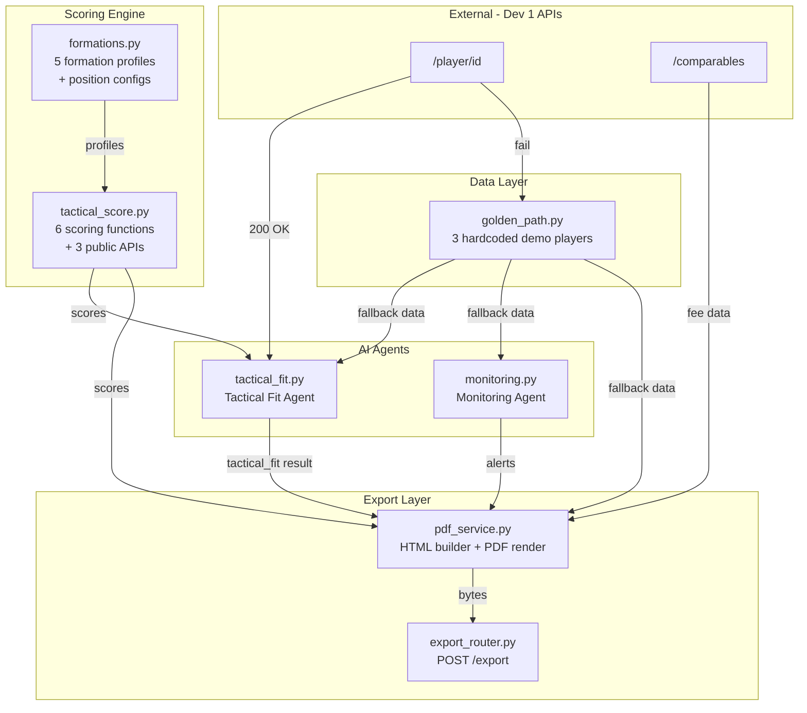
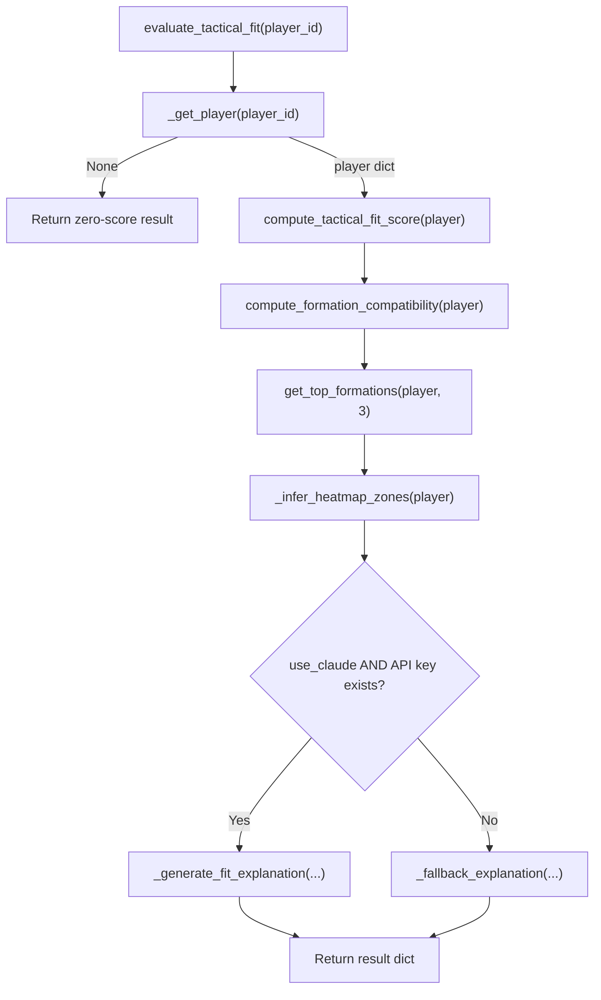
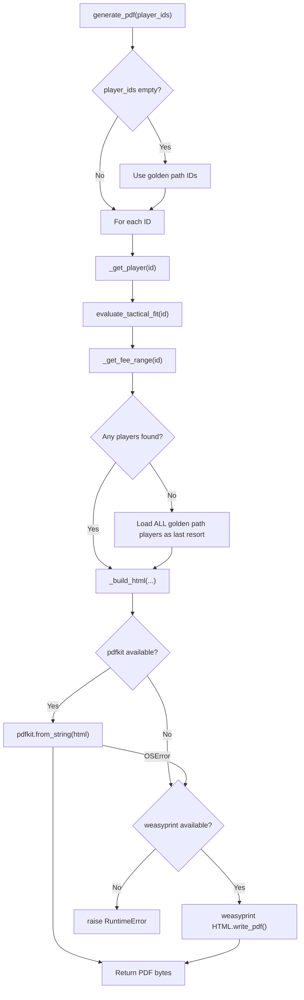
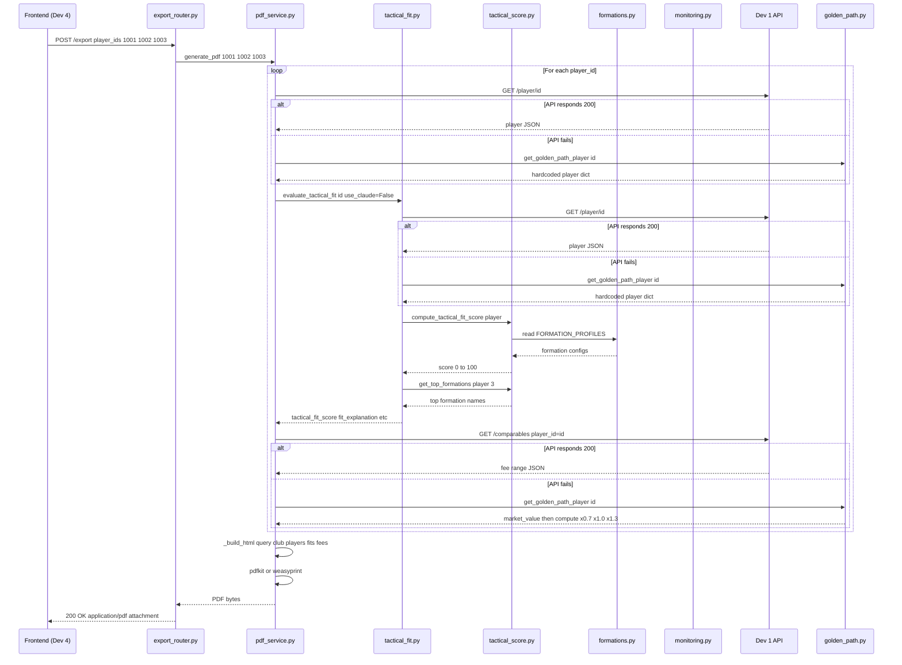
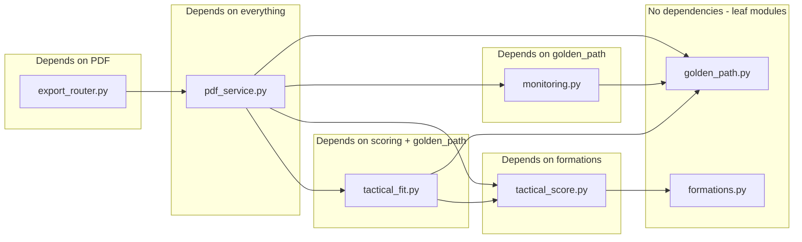

# ScoutR — Complete Code Deep Dive

---

## Table of Contents

1. [Project Structure](#1-project-structure)
2. [Architecture Overview](#2-architecture-overview)
3. [Module 1 — `golden_path.py`](#3-module-1--golden_pathpy)
4. [Module 2 — `scoring/formations.py`](#4-module-2--scoringformationspy)
5. [Module 3 — `scoring/tactical_score.py`](#5-module-3--scoringtactical_scorepy)
6. [Module 4 — `agents/tactical_fit.py`](#6-module-4--agentstactical_fitpy)
7. [Module 5 — `agents/monitoring.py`](#7-module-5--agentsmonitoringpy)
8. [Module 6 — `export/pdf_service.py`](#8-module-6--exportpdf_servicepy)
9. [Module 7 — `api/export_router.py`](#9-module-7--apiexport_routerpy)
10. [Package Init Files](#10-package-init-files)
11. [Configuration Files](#11-configuration-files)
12. [Integration Contracts](#12-integration-contracts)
13. [Test Suite](#13-test-suite)
14. [End-to-End Data Flow](#14-end-to-end-data-flow)
15. [Cross-Module Dependency Map](#15-cross-module-dependency-map)

---

## 1. Project Structure

```
scoutr/                          # Root directory
├── ScoutR.md                    # The hackathon plan / spec
├── README.md                    # Project overview
├── INTEGRATION_CONTRACTS.md     # API contracts for other devs
├── pyproject.toml               # Build config + dependencies
├── requirements.txt             # Pip requirements
├── scoutr/                      # Main Python package
│   ├── __init__.py              # Package marker
│   ├── golden_path.py           # Demo fallback dataset
│   ├── scoring/                 # Math engine
│   │   ├── __init__.py
│   │   ├── formations.py        # Formation config data
│   │   └── tactical_score.py    # Scoring algorithms
│   ├── agents/                  # AI agent modules
│   │   ├── __init__.py
│   │   ├── tactical_fit.py      # Tactical Fit Agent
│   │   └── monitoring.py        # Monitoring Agent
│   ├── export/                  # PDF generation
│   │   ├── __init__.py
│   │   └── pdf_service.py       # HTML→PDF renderer
│   └── api/                     # FastAPI routes
│       ├── __init__.py
│       └── export_router.py     # POST /export endpoint
└── tests/                       # Test suite
    ├── __init__.py
    ├── conftest.py              # Pytest fixtures
    ├── test_golden_path.py
    ├── test_formations.py
    ├── test_tactical_score.py
    ├── test_tactical_fit.py
    ├── test_monitoring.py
    ├── test_export.py
    └── test_api_export_router.py
```

---

## 2. Architecture Overview



### The Core Design Principle: Fail-Safe Fallbacks

Every function that talks to an external API follows this exact pattern:

```
1. Try to call Dev 1 API (http://localhost:8000/...)
2. If HTTP call succeeds with 200 → use that data
3. If HTTP call fails (timeout, connection refused, non-200) → silently catch exception
4. Call get_golden_path_player(id) → return hardcoded demo data
```

This means the demo **never breaks**, regardless of whether Dev 1's backend is running.

---

## 3. Module 1 — `golden_path.py`

**Purpose**: Provides a hardcoded dataset of 3 real football players for the "Leeds United left-back" demo scenario. Acts as the universal fallback when any API call fails.

### Constants

#### `GOLDEN_PATH_PLAYER_IDS`
```python
GOLDEN_PATH_PLAYER_IDS = [1001, 1002, 1003]
```
A simple list of the three demo player IDs. Used by `pdf_service.py` when `generate_pdf()` is called with an empty `player_ids` list — it defaults to these three.

#### `GOLDEN_PATH_PLAYERS`
A list of 3 dictionaries. Each dictionary is a **complete player record** with every field that the scoring engine and agents expect:

| Player ID | Name | Club | League | Age | Position | Contract Expiry | Market Value |
|---|---|---|---|---|---|---|---|
| 1001 | Junior Firpo | Real Betis | La Liga | 23 | left-back | 2025-06-30 | €4,500,000 |
| 1002 | Alfie Doughty | Luton Town | Championship | 22 | left-back | 2025-01-15 | €2,800,000 |
| 1003 | Rico Henry | Brentford | Championship | 24 | left-back | 2026-06-30 | €5,500,000 |

Each player also has:
- `press_metrics`: `{"ppda": float, "pressure_success_rate": float}` — PPDA = Passes allowed Per Defensive Action. Lower = more aggressive pressing. Pressure success rate = what fraction of pressing attempts win the ball back.
- `defensive_actions_per_90`: tackles + interceptions + blocks per 90 minutes.
- `progressive_carries`: ball carries that move play forward per 90 minutes.
- `xA`: expected assists per 90.
- `xG`: expected goals per 90.

> **IMPORTANT**: These values are carefully chosen. Junior Firpo has a PPDA of 9.2 (good presser), Alfie Doughty has 10.1 (decent), Rico Henry has 8.8 (best presser). This creates a meaningful ranking when the scoring engine runs.

### Functions

#### `get_golden_path_player(player_id: int) → dict | None`
- Iterates through `GOLDEN_PATH_PLAYERS` looking for a matching `player_id`.
- Returns a **copy** (`.copy()`) of the dict, not a reference. This prevents test mutations from corrupting the source data.
- Returns `None` if the ID isn't found. This is important — `tactical_fit.py` checks for `None` and returns a zero-score result.

#### `get_golden_path_players() → list[dict]`
- Returns **copies** of all 3 players. Used by `pdf_service.py` as a last-resort fallback.

#### `get_golden_path_player_ids() → list[int]`
- Returns a **copy** of `[1001, 1002, 1003]`. The copy prevents callers from accidentally mutating the module-level constant.

---

## 4. Module 2 — `scoring/formations.py`

**Purpose**: Pure configuration data. No logic. Defines the "ideal" stats for each football formation and the expected stats for each position. Think of this as a lookup table that `tactical_score.py` reads from.

### `FORMATION_PROFILES` (dict of 5 formations)

Each formation maps to a dictionary with these keys:

| Key | Type | Meaning |
|---|---|---|
| `description` | str | Human-readable description of the style |
| `pressing_intensity` | str | Category: "high", "medium_high", "medium" |
| `ppda_ideal` | float | The PPDA number that scores 100/100. Lower = more pressing |
| `ppda_max` | float | The PPDA above which the score is 0/100 |
| `pressure_success_min` | float | Minimum acceptable pressure success rate |
| `progressive_carries_min` | float | Minimum progressive carries per 90 |
| `width` | str | How wide the formation plays |
| `ball_progression` | str | How much vertical ball movement is expected |

**The 5 formations and their pressing demands:**

| Formation | PPDA Ideal | PPDA Max | Pressure Success Min | Prog Carries Min |
|---|---|---|---|---|
| **4-3-3** | 8.0 | 12.0 | 0.32 | 2.0 |
| **4-2-3-1** | 10.0 | 14.0 | 0.28 | 1.5 |
| **3-5-2** | 12.0 | 16.0 | 0.24 | 1.2 |
| **4-4-2** | 11.0 | 15.0 | 0.26 | 1.0 |
| **3-4-3** | 9.0 | 11.0 | 0.30 | 2.2 |

> **NOTE**: 4-3-3 is the most demanding (Pep Guardiola style). A player with PPDA ≤ 8 scores perfect. 3-5-2 is the most forgiving.

### `DEFENSIVE_ACTIONS_BY_POSITION` (dict)

Defines `(min_expected, ideal)` tuples for 8 positions:

```
left-back:            (6.0, 12.0)
right-back:           (6.0, 12.0)
centre-back:          (7.0, 14.0)
defensive-midfield:   (8.0, 15.0)
central-midfield:     (4.0, 10.0)
attacking-midfield:   (2.0, 6.0)
winger:               (2.0, 6.0)
forward:              (1.0, 4.0)
```

A left-back with 6 defensive actions per 90 scores ~60/100. At 12, they score 100/100.

### `HEATMAP_CENTROID_BY_POSITION` (dict)

Normalized X,Y coordinates (0–1 scale) for where a player in each position *should* be on the pitch:

```
left-back:  (0.15, 0.35)   → left side, own half
forward:    (0.50, 0.75)   → centre, attacking third
```

X=0 is the left touchline, X=1 is the right. Y=0 is the player's own goal, Y=1 is the opponent's goal.

### `POSITION_FORMATION_WEIGHTS` (dict)

A position-to-formation affinity multiplier. Example for `left-back`:

```python
{"4-3-3": 1.2, "3-5-2": 1.1, "3-4-3": 1.2, "4-2-3-1": 1.0, "4-4-2": 0.9}
```

This means a left-back's compatibility score for 4-3-3 gets multiplied by 1.2 (boosted 20%), while for 4-4-2 it gets multiplied by 0.9 (reduced 10%). This reflects the reality that left-backs are more important in wide formations like 4-3-3 than in narrow 4-4-2 setups.

---

## 5. Module 3 — `scoring/tactical_score.py`

**Purpose**: The mathematical engine. Takes raw player stats and formation profiles and produces numerical scores from 0 to 100. Contains no AI/LLM logic — pure deterministic math.

### Internal Helper: `_get_nested(player, *keys, default=0.0) → float`

Safely navigates nested dictionaries. This exists because player data can come in two shapes:
- **Nested**: `{"press_metrics": {"ppda": 9.2}}`
- **Flat**: `{"ppda": 9.2}`

The function walks through each key. If any key is missing or the final value is `None`, it returns `default`. It also does `float()` conversion with error handling. This one helper prevents `KeyError` and `TypeError` crashes across the entire scoring engine.

### Internal Helper: `_get_press_metrics(player) → (ppda, pressure_success_rate)`

Extracts PPDA and pressure success rate from a player dict. It tries 3 paths in order:

1. `player["press_metrics"]["ppda"]` (nested format from Dev 1 API)
2. `player["ppda"]` (flat format, legacy)
3. Default: `ppda=12.0`, `pressure_success_rate=0.30` (neutral values)

Special case: if `ppda` comes back as `0.0`, it resets to `12.0`. This prevents division-by-zero in downstream calculations and avoids an unrealistically perfect score (PPDA of 0 would mean infinite pressing, which isn't real).

### Scoring Functions (all return 0–100 float)

#### `_score_ppda_fit(ppda, profile) → float`

**Logic**: Linear interpolation between `ppda_ideal` and `ppda_max`.

```
If ppda ≤ ideal → 100 (perfect presser for this formation)
If ppda ≥ max   → 0   (doesn't press enough)
Otherwise       → 100 - ((ppda - ideal) / (max - ideal)) × 100
```

**Example for 4-3-3** (ideal=8, max=12):
- PPDA 8.0 → score 100
- PPDA 10.0 → score 50
- PPDA 12.0 → score 0
- PPDA 6.0 → score 100 (below ideal is still perfect)

#### `_score_pressure_success(rate, profile) → float`

**Logic**: Two-tier scoring.

```
If rate ≥ 0.40  → 100 (elite presser)
If rate < min   → (rate / min) × 50  (poor, max 50 points)
Otherwise       → 50 + ((rate - min) / (0.40 - min)) × 50
```

The 0.40 threshold is a universal "elite" ceiling. Below `pressure_success_min`, the player is penalized heavily — they can't score above 50.

#### `_score_progressive_carries(carries, profile) → float`

**Logic**: Similar two-tier system.

```
If carries ≥ min × 1.5  → 100
If carries < min × 0.5  → (carries / (min × 0.5)) × 50
Otherwise               → 50 + ((carries - min×0.5) / min) × 50
```

For 4-3-3 with `min=2.0`: a player with 3.0+ carries scores 100, at 1.0 scores ~50, and below 1.0 scores less than 50.

#### `_score_defensive_actions(actions, position) → float`

**Logic**: Uses `DEFENSIVE_ACTIONS_BY_POSITION` lookup.

```
If actions ≥ ideal → 100
If actions < min   → (actions / min) × 60   (max 60 when below minimum)
Otherwise          → 60 + ((actions - min) / (ideal - min)) × 40
```

The floor is 60% (not 50%) when at minimum expected. This is because even a player at the minimum is still "acceptable", just not great.

#### `_score_heatmap_centroid(centroid, position) → float`

**Logic**: Euclidean distance between actual and ideal position.

```python
dist = sqrt((x - ideal_x)² + (y - ideal_y)²)
If dist ≤ 0.1 → 100 (within ~10% of ideal)
Otherwise     → max(0, 100 - dist × 150)
```

If `centroid` is `None` or not a dict → returns **50** (neutral). This is intentional — many players won't have heatmap data, so the score neither helps nor hurts them.

### Public API Functions

#### `compute_formation_compatibility(player) → dict[str, float]`

The master scoring loop. For each of the 5 formations:

1. Extract press metrics, carries, defensive actions, centroid, position
2. Calculate 5 sub-scores using the functions above
3. Combine with weights:
   - PPDA: **30%**
   - Pressure success: **30%**
   - Progressive carries: **15%**
   - Defensive actions: **15%**
   - Heatmap centroid: **10%**
4. Multiply by position-formation affinity weight from `POSITION_FORMATION_WEIGHTS`
5. Cap at 100, round to 1 decimal

Returns e.g.: `{"4-3-3": 85.2, "4-2-3-1": 72.1, "3-5-2": 68.4, "4-4-2": 61.0, "3-4-3": 79.8}`

#### `compute_tactical_fit_score(player) → float`

Takes the formation compatibility dict and computes one master score:

```python
weights = {"4-3-3": 1.2, "4-2-3-1": 1.1, "3-5-2": 1.0, "4-4-2": 1.0, "3-4-3": 1.0}
score = sum(compat[f] × weight[f]) / sum(weight[f])
```

4-3-3 is weighted 1.2× because it is the most common high-pressing formation. If `compute_formation_compatibility` somehow returned empty, returns 50.0 as safe default.

#### `get_top_formations(player, top_n=3) → list[str]`

Calls `compute_formation_compatibility`, sorts by score descending, returns the top N formation names. Example: `["4-3-3", "3-4-3", "4-2-3-1"]`.

---

## 6. Module 4 — `agents/tactical_fit.py`

**Purpose**: The Tactical Fit Agent. Combines the scoring engine with an AI-generated narrative. This is the "smart" layer that turns numbers into prose a sporting director can read.

### Constant: `POSITION_HEATMAP_ZONES`

Maps 8 positions to lists of named pitch zones (strings). Example:
```python
"left-back": ["left-flank", "left-third", "defensive-third"]
"forward":   ["attacking-third", "centre", "penalty-area"]
```

These are human-readable zone names used in the output JSON and in the LLM prompt. They are NOT the same as the X,Y centroids in `formations.py` — these are qualitative labels, not coordinates.

### `_get_player(player_id, api_base_url) → dict | None`

The standard fail-safe fetcher:

```python
try:
    HTTP GET {api_base_url}/player/{player_id}
    if 200 → return response JSON
except anything → pass (swallow error)
return get_golden_path_player(player_id)  # fallback
```

Uses `httpx.Client` with a 10-second timeout. The `with` statement ensures the HTTP connection is properly closed even on error.

### `_infer_heatmap_zones(player) → list[str]`

1. If the player dict has an explicit `heatmap_zones` list → return it (capped at 5 entries).
2. Otherwise, look up the player's `position` in `POSITION_HEATMAP_ZONES`.
3. If position not found → default to `["centre", "middle-third"]`.

The position string is normalized: lowercased and spaces replaced with hyphens (e.g., "Left Back" → "left-back").

### `_generate_fit_explanation(player, score, formation_compat, zones) → str`

This is where the LLM is called. The function has 3 tiers:

**Tier 1 — No API keys available:**
Returns a template string: `"{name} scores {score}/100 for tactical fit. Best formations: {formations}. Primary zones: {zones}."`

**Tier 2 — Gemini API key (`GEMINI_API_KEY` env var):**
1. Builds a prompt asking for "2-3 sentences explaining why this player fits a high-pressing system"
2. Includes: player name, position, club, tactical fit score, formation compatibility, heatmap zones, pressing metrics, progressive carries
3. Calls `google.generativeai` with model `gemini-2.5-flash`
4. If the response is empty or errors → falls through to Tier 3

**Tier 3 — Anthropic API key (`ANTHROPIC_API_KEY` env var):**
1. Same prompt as Tier 2
2. Calls `anthropic.Anthropic.messages.create` with model `claude-3-5-sonnet-20241022`, max 200 tokens
3. If the response is empty or errors → falls through to `_fallback_explanation`

> **NOTE**: The `import` statements for `google.generativeai` and `anthropic` are inside the function body, not at the top of the file. This is intentional — the libraries are optional. If they're not installed, the ImportError is caught and the function gracefully falls to the next tier.

### `_fallback_explanation(player, score) → str`

Used when no LLM is available. Calls `get_top_formations(player, 3)` to get formation names, then returns a templated string:

```
"{name} offers a tactical fit of {score}/100. Best suited to {formations}. 
Suitable for high-press systems if pressing metrics align."
```

### `evaluate_tactical_fit(player_id, api_base_url, use_claude) → dict`

**This is the main entry point. Other modules call this function.**

The flow:



**Return schema (exact contract with Dev 2 and Dev 4):**
```json
{
    "tactical_fit_score": 85.2,
    "fit_explanation": "Junior Firpo scores well...",
    "heatmap_zones": ["left-flank", "left-third", "defensive-third"],
    "formation_compatibility": ["4-3-3", "3-4-3", "4-2-3-1"]
}
```

If the player is not found (both API and golden path return None), returns:
```json
{
    "tactical_fit_score": 0,
    "fit_explanation": "Player {id} not found.",
    "heatmap_zones": [],
    "formation_compatibility": []
}
```

---

## 7. Module 5 — `agents/monitoring.py`

**Purpose**: The Monitoring Agent. Watches a list of player IDs and generates alerts about contract urgency, competitor scouts, and club financial trouble.

### Type Aliases

```python
AlertType = Literal["contract_urgency", "competitor_scout", "club_finances"]
Severity = Literal["green", "amber", "red"]
```

These are type hints for documentation and IDE support. They enforce that alert types and severities can only be one of the listed values.

### `_get_player(player_id, api_base_url) → dict | None`

Identical pattern to `tactical_fit.py`'s `_get_player`. Same timeout, same fallback to golden path. This is duplicated rather than shared — acceptable for hackathon speed.

### `_months_until_expiry(contract_expiry: str | None) → float | None`

**Date math function.** Converts a contract expiry date string into "months from now":

1. If `None` or empty → return `None`
2. Parse the ISO date string (handles both `2025-06-30` and `2025-06-30T00:00:00Z` formats)
3. If the parsed date has no timezone info, assume UTC
4. Subtract `datetime.now(UTC)` → get a `timedelta`
5. Convert days to months: `delta.days / 30.0`
6. Return the float (can be negative if contract already expired)

> **WARNING**: The `/ 30.0` approximation means "months" are 30-day periods, not calendar months. This is fine for red/amber/green categorization but not for precise contract negotiation dates.

### `_contract_urgency_alerts(player_id, player) → list[dict]`

Takes a player dict and generates 0 or 1 alert based on contract expiry:

| Months Until Expiry | Severity | Message Template |
|---|---|---|
| < 0 (expired) | **red** | `"{name} — contract has expired. Free agent."` |
| 0–3 | **red** | `"{name} — contract expires in {days} days. Urgent."` |
| 3–6 | **amber** | `"{name} — contract expires in {months} months. Act soon."` |
| 6–12 | **green** | `"{name} — contract expires in {months} months. Monitor."` |
| > 12 | — | No alert generated |

Each alert is a dict with: `player_id`, `type` ("contract_urgency"), `severity`, `message`, `timestamp` (ISO 8601).

### `_mock_competitor_scout_alerts(player_ids) → list[dict]`

**Demo stub.** Creates exactly one "competitor_scout" alert for the first player in the list. The message includes `[DEMO]` prefix so judges know it's simulated. Returns empty list if `player_ids` is empty.

### `_mock_club_finances_alerts(player_ids, players) → list[dict]`

**Demo stub.** Looks for any player with `market_value < 4,000,000`. If found, creates one "club_finances" alert suggesting the club may be open to offers. Only triggers for the **first** matching player, then `break`s out of the loop.

### `check_watchlist(watchlist, api_base_url, include_mock_alerts) → dict`

**This is the main entry point.**

Flow:
1. For each player ID in `watchlist`:
   - Fetch player data (`_get_player`)
   - Generate contract urgency alerts for that player
2. If `include_mock_alerts` is `True` (default):
   - Add mock competitor scout alerts
   - Add mock club finances alerts
3. Sort all alerts by severity (red first, then amber, then green), breaking ties by timestamp
4. Return `{"alerts": [list of alert dicts]}`

The severity sort uses a dict lookup: `{"red": 0, "amber": 1, "green": 2}`. Lower number = higher priority = appears first.

---

## 8. Module 6 — `export/pdf_service.py`

**Purpose**: Gathers data from all agents and renders a professional scouting report as a downloadable PDF.

### Library Detection

At import time, the module probes for two PDF backends:

```python
try:
    import pdfkit
    PDFKIT_AVAILABLE = True
except (ImportError, OSError):
    PDFKIT_AVAILABLE = False

try:
    from weasyprint import HTML
    WEASYPRINT_AVAILABLE = True
except ImportError:
    WEASYPRINT_AVAILABLE = False
```

`pdfkit` wraps `wkhtmltopdf` (a system binary). `weasyprint` is a pure-Python alternative. The module tries `pdfkit` first, then `weasyprint`. If neither works, `generate_pdf()` raises `RuntimeError`.

### `_get_player(player_id, api_base_url) → dict | None`

Same pattern as the other modules. Tries API, falls back to golden path.

### `_get_fee_range(player_id, api_base_url) → (low, mid, high)`

Tries to call Dev 1's `/comparables?player_id={id}` endpoint. If successful, extracts `low_fee`/`mid_fee`/`high_fee` (or `low`/`mid`/`high` as alternative keys).

**Fallback**: If the API call fails, looks up the player in golden path and calculates:
```python
low  = market_value × 0.7
mid  = market_value × 1.0
high = market_value × 1.3
```
Formatted as `"€{value:,}"` (e.g., `"€3,150,000"`).

If even the golden path lookup fails, returns `("N/A", "N/A", "N/A")`.

### `_contract_risk(contract_expiry) → str`

Reuses `_months_until_expiry` from `monitoring.py` (imported at top of file) to categorize risk:
- `None` months → `"N/A"`
- < 3 months → `"red"`
- < 6 months → `"amber"`
- ≥ 6 months → `"green"`

### `_build_html(query, club, players, tactical_fits, fee_ranges) → str`

Generates a complete HTML document as a Python f-string. The HTML includes:

- **CSS**: Inline styles — Arial font, blue header bar (#0066cc), alternating row colors, clean table borders
- **Cover section**: Report title, club name, date, original query
- **Player table**: One row per player with 7 columns:
  1. Name
  2. Club
  3. Age
  4. Tactical Score (from `tactical_fits` dict, or computed on the fly)
  5. Contract Risk (red/amber/green)
  6. Fee Range (low – high)
  7. Key Stats (PPDA + progressive carries)

### `generate_pdf(player_ids, query, club, api_base_url) → bytes`

**Main entry point. Called by the API router.**



> **IMPORTANT**: `evaluate_tactical_fit` is called with `use_claude=False` inside PDF generation. This is deliberate — PDF export should be fast and deterministic, not waiting for an LLM API call.

---

## 9. Module 7 — `api/export_router.py`

**Purpose**: Exposes the PDF export functionality as a FastAPI REST endpoint.

### `ExportRequest` (Pydantic model)

```python
class ExportRequest(BaseModel):
    player_ids: list[int]        # Required
    query: str = ""              # Optional, defaults to empty
    club: str = "Leeds United"   # Optional, defaults to Leeds
```

Pydantic validates the incoming JSON automatically. If `player_ids` is missing or not a list of ints, FastAPI returns a 422 error.

### `export_router` (FastAPI APIRouter)

```python
export_router = APIRouter(prefix="", tags=["export"])
```

No URL prefix — the `/export` path is defined on the route itself. The `tags=["export"]` groups it in auto-generated API docs.

### `POST /export` handler

```python
@export_router.post("/export")
async def export_report(req: ExportRequest) -> Response:
```

1. Calls `generate_pdf(req.player_ids, req.query, req.club)`
2. Returns `Response` with:
   - `content`: raw PDF bytes
   - `media_type`: `"application/pdf"`
   - `Content-Disposition: attachment; filename=scoutr_report.pdf` (triggers browser download)
3. Error handling:
   - `RuntimeError` (no PDF backend) → HTTP **503** Service Unavailable
   - Any other exception → HTTP **500** Internal Server Error

**Dev 1 integration**: Dev 1 includes this router in their main FastAPI app:
```python
from scoutr.api.export_router import export_router
app.include_router(export_router)
```

---

## 10. Package Init Files

All `__init__.py` files are minimal — they contain only a docstring:

| File | Docstring |
|---|---|
| `scoutr/__init__.py` | `"ScoutR - Agentic AI Transfer Intelligence for Football Clubs."` |
| `scoutr/agents/__init__.py` | `"ScoutR AI agents."` |
| `scoutr/api/__init__.py` | `"API routes for Dev 1 FastAPI integration."` |
| `scoutr/export/__init__.py` | `"PDF export for scouting reports."` |
| `scoutr/scoring/__init__.py` | `"Tactical scoring models and formation profiles."` |
| `tests/__init__.py` | `"ScoutR tests."` |

They make Python treat each directory as a package (importable). No re-exports are defined — all imports use full paths like `from scoutr.agents.tactical_fit import evaluate_tactical_fit`.

---

## 11. Configuration Files

### `pyproject.toml`

```toml
[build-system]
requires = ["setuptools>=61.0"]
build-backend = "setuptools.build_meta"

[project]
name = "scoutr"
version = "0.1.0"
requires-python = ">=3.10"
dependencies = [
    "anthropic>=0.39.0",
    "fastapi>=0.115.0",
    "httpx>=0.27.0",
    "pdfkit>=1.0.0",
    "pydantic>=2.0.0",
]
```

This is a PEP 621 project file. `setuptools` builds the package. The `scoutr.egg-info` directory in the repo root means someone ran `pip install -e .` (editable install).

`[tool.pytest.ini_options]` sets `testpaths = ["tests"]` and `pythonpath = ["."]` so pytest can find the `scoutr` package without install.

### `requirements.txt`

Includes additional optional deps not in `pyproject.toml`:
- `google-generativeai>=0.8.0` — for Gemini LLM
- `pytest>=8.0.0` — test runner
- `weasyprint>=62.0` — fallback PDF backend

---

## 12. Integration Contracts

**File**: `INTEGRATION_CONTRACTS.md`

This document tells Dev 1, Dev 2, and Dev 4 exactly what Dev 3's code expects and produces:

1. **Tactical Fit Output Schema** — the JSON shape returned by `evaluate_tactical_fit()`
2. **Monitoring Alerts Schema** — the JSON shape returned by `check_watchlist()`
3. **POST /export contract** — request body, response format, and how Dev 1 wires the router
4. **Player Schema expectations** — what fields Dev 1's `/player/{id}` must return
5. **Golden Path Player IDs** — 1001, 1002, 1003 (so Dev 1 can seed these in their database)

---

## 13. Test Suite

### `tests/conftest.py` — Global Test Configuration

```python
@pytest.fixture(autouse=True)
def unset_api_keys(monkeypatch):
    monkeypatch.delenv("GEMINI_API_KEY", raising=False)
    monkeypatch.delenv("ANTHROPIC_API_KEY", raising=False)
```

`autouse=True` means this fixture runs **before every single test** in the entire suite. It removes LLM API keys from the environment so that:
- No real LLM API calls are made during tests
- All tests exercise the fallback code paths
- Tests are free, fast, and deterministic

### Test Files Summary

| File | Target Module | Tests | What It Verifies |
|---|---|---|---|
| `test_golden_path.py` | `golden_path.py` | 7 | Constants are correct, returns copies, None for unknown IDs |
| `test_formations.py` | `scoring/formations.py` | 4 | All 5 formations exist, required keys present, ppda_ideal < ppda_max |
| `test_tactical_score.py` | `scoring/tactical_score.py` | 16 | Every scoring function, edge cases, golden path player scores sensible range |
| `test_tactical_fit.py` | `agents/tactical_fit.py` | 7 | Output schema matches contract, score in range, fallback works when API unreachable |
| `test_monitoring.py` | `agents/monitoring.py` | 9 | Date parsing, alert generation, mock alerts, watchlist output schema |
| `test_export.py` | `export/pdf_service.py` | 5 | Fee range fallback, contract risk logic, HTML content, PDF generation |
| `test_api_export_router.py` | `api/export_router.py` | 3 | ExportRequest defaults, endpoint returns 200/503 |

**Key test patterns:**

1. **API unreachability**: Tests use `api_base_url="http://localhost:99999"` — a port nothing listens on. This forces every test to exercise the golden path fallback.

2. **PDF skip logic**: PDF tests use `pytest.skip()` when no PDF backend is installed, so CI doesn't fail on machines without `wkhtmltopdf` or `weasyprint`.

3. **Schema validation**: `test_tactical_fit.py::test_output_schema` checks that the returned dict has exactly the 4 keys documented in `INTEGRATION_CONTRACTS.md`.

---

## 14. End-to-End Data Flow

Here is the complete path from a user clicking "Export PDF" to receiving the file:



---

## 15. Cross-Module Dependency Map



**Import graph (what each file imports from within the project):**

| File | Imports From |
|---|---|
| `golden_path.py` | nothing (leaf module) |
| `formations.py` | nothing (leaf module) |
| `tactical_score.py` | `formations.py` |
| `tactical_fit.py` | `golden_path.py`, `tactical_score.py` |
| `monitoring.py` | `golden_path.py` |
| `pdf_service.py` | `monitoring.py` (`_months_until_expiry`), `tactical_fit.py` (`evaluate_tactical_fit`), `golden_path.py`, `tactical_score.py` (`compute_tactical_fit_score`) |
| `export_router.py` | `pdf_service.py` (`generate_pdf`) |

> **TIP**: The two "leaf" modules (`golden_path.py` and `formations.py`) have zero internal imports. This means they can never participate in circular import issues. Everything else is a clean DAG (directed acyclic graph).

---
